<div align="center">

<picture>
  <source media="(prefers-color-scheme: dark)" srcset="assets/header.svg">
  <source media="(prefers-color-scheme: light)" srcset="assets/header.svg">
  
</picture>

</div>

<br>

<div align="center">

```
                    ◆ PRTS OPERATIONAL DOSSIER ◆

    "把一千个 AI 塞进 Docker，让它们自己写代码。
     不是开玩笑，是在建的东西。"
```

</div>

<br>

## `>_ OPERATIONAL BRIEF`

```diff
+ 不写 CRUD。不做外包。不搞 PPT 架构。

  构建让 AI 自治运行的基础设施——
  从编码集群到服务器治理到量化交易，
  全链路，全自动，全实战。
```

<br>

<div align="center">

<picture>
  <source media="(prefers-color-scheme: dark)" srcset="assets/projects.svg">
  <source media="(prefers-color-scheme: light)" srcset="assets/projects.svg">
  
</picture>

</div>

<br>

## `>_ DEPLOYMENT MAP`

<div align="center">

<picture>
  <source media="(prefers-color-scheme: dark)" srcset="assets/topology.svg">
  <source media="(prefers-color-scheme: light)" srcset="assets/topology.svg">
  
</picture>

</div>

<br>

## `>_ COMBAT RECORD`

<table>
<tr><td>

### openclaw/openclaw — AI 助手网关平台

```
 FIX  prompt cache 因 reasoning toggle 失效
 FIX  chat.inject 缺少 transcript 文件时报错
 FIX  kimi-coding 忽略用户自定义 baseUrl
 FIX  Gemini 3.1 在 google provider 下 fallback 路由失败
 FIX  文件上传因 mediaLocalRoots 缺失被拦截
```

</td></tr>
</table>

<br>

## `>_ ARSENAL`

```
  LANGUAGES         Python · TypeScript · Rust · C
  RUNTIME           Bun · Docker · systemd
  DATA              Redis 7 · DuckDB · PostgreSQL
  AI/ML             PyTorch · TFT · smolagents · LiteLLM
  NETWORK           WireGuard · SSH Tunnel Mesh
  TRADING           pytdx · QMT · THS · AKShare
  INFRA             OPA/Rego · OpenClaw · Jinja2
  FRONTEND          Next.js · Tailwind CSS
  RE                Ghidra · Frida · GhidraMCP
```

<br>

<div align="center">


</div>

<br>

<div align="center">

<picture>
  <source media="(prefers-color-scheme: dark)" srcset="assets/footer.svg">
  <source media="(prefers-color-scheme: light)" srcset="assets/footer.svg">
  
</picture>

</div>
